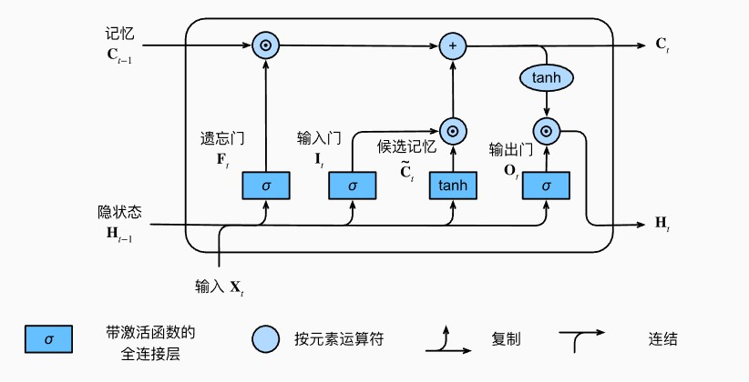
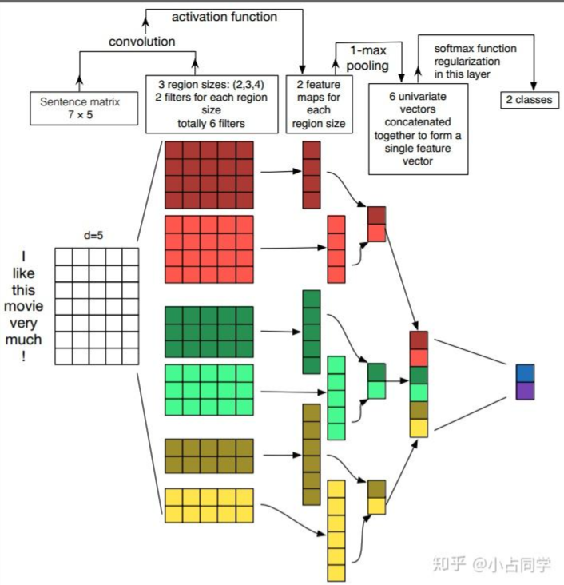

### 代码应用与实践任务其一

分类任务是最简单也最易学习的应用场景，这个代码任务可以分类任务来帮助大家入门NLP这一领域。

（1） IMDB情感分析任务基本上算是一个已经被刷烂掉了的任务，不过也是很好的入门学习任务

1. 从[官网](https://ai.stanford.edu/~amaas/data/sentiment/)上下载数据集
2. 由于文本的离散特性，往往需要先利用一些库对文本进行tokenize
3. 根据tokenize之后的token得到对应的word embedding
4. 从word embedding开始接入常规的模型训练过程
5. 使用基本的textcnn、lstm实现，准确率不做要求

（2）学习最基本的预训练模型，bert和gpt**选其一**（多做加分，~~全选最好~~）

1. 掌握transformer模型原理

2. 自己动手实现bert/gpt以及第一问实现的tokenizer完成IMDB分类任务

   * 从头开始训练的bert/gpt最后准确率较差属于正常现象，不必过分纠结调参

3. 使用预训练好的bert/gpt以及它们对应的tokenizer进行finetune，完成IMDB分类任务

   * 调用的库不做要求，强烈建议使用transformers库

   * [transformers库官方文档](https://huggingface.co/docs/transformers/training) ，官方文本分类[代码参考](https://github.com/huggingface/transformers/blob/main/examples/pytorch/text-classification/)
   * 不能直接使用已经在IMDB上finetune好的模型权重
   * 开源的gpt预训练权重用的别较多的是gpt2，跟gpt模型上没有太大区别

4. 比较bert和gpt的区别

说明：

* 我们不做准确率要求，但希望你在使用非finetune方法（textcnn/lstm/自己实现的bert/gpt）最高能达到90%或者使用finetune方法能达到92%，**前者达到92%或者后者达到95%的正确率可直接获得面试资格**（此项请于截止日期前将结果提交给相关人员核验以确定直通通道资格）
* **没做完或者准确率很低也没关系！**我们希望你每个完成的部分都有完整可运行的代码，**态度最重要**


（1） IMDB情感分析任务基本上算是一个已经被刷烂掉了的任务，不过也是很好的入门学习任务

1. 从[官网](https://ai.stanford.edu/~amaas/data/sentiment/)上下载数据集
2. 由于文本的离散特性，往往需要先利用一些库对文本进行tokenize
3. 根据tokenize之后的token得到对应的word embedding
4. 从word embedding开始接入常规的模型训练过程
5. 使用基本的textcnn、lstm实现，准确率不做要求


1234使用torchtext定义的库函数，以及预定义好的nn.Embedding层可以完成实现

### LSTM的实现

LSTM的最主要实现流程图如下所示：



首先是定义了遗忘门，输入门，输出门，以及候选记忆单元：
$$
\mathbf{I}_{t} =\sigma(\mathbf{X}_t\mathbf{W}_{xi}+\mathbf{H}_{t-1}\mathbf{W}_{hi}+\mathbf{b}_i), \\
\mathbf{F}_{t} =\sigma(\mathbf{X}_t\mathbf{W}_{xf}+\mathbf{H}_{t-1}\mathbf{W}_{hf}+\mathbf{b}_f), \\
\mathbf{O}_{t} =\sigma(\mathbf{X}_t\mathbf{W}_{xo}+\mathbf{H}_{t-1}\mathbf{W}_{ho}+\mathbf{b}_o),\\
\tilde{\mathbf{C}}_t=\tanh(\mathbf{X}_t\mathbf{W}_{xc}+\mathbf{H}_{t-1}\mathbf{W}_{hc}+\mathbf{b}_c),
$$
其中$\sigma(x)$为$sigmoid$激活函数 ，这些计算实际上和RNN中隐状态的计算比较类似

下面我们定义记忆元
$$
\mathbf{C}_t=\mathbf{F}_t\odot\mathbf{C}_{t-1}+\mathbf{I}_t\odot\tilde{\mathbf{C}}_t
$$
$\mathbf{F}_t\odot\mathbf{C}_{t-1}$实际上表示了遗忘多少先前的记忆元$\mathbf{C}_{t-1}$，而$\mathbf{I}_t\odot\tilde{\mathbf{C}}_t$ 则代表了当前候选记忆元使用的程度

$LSTM$中隐状态的定义如下：
$$
\mathbf{H}_t=\mathbf{O}_t\odot\tanh(\mathbf{C}_t)
$$
这样的定义可以保证每个元素均在$[-1,1]$之间，防止梯度爆炸

下面我们从零实现$LSTM$, 参考了李沐老师的[14. 自然语言处理：预训练 — 动手学深度学习 2.0.0 documentation (d2l.ai)](http://zh-v2.d2l.ai/chapter_natural-language-processing-pretraining/index.html)()

首先我们定义初始参数的函数：

```python
def init_params(shape):
    return torch.zeros(shape, requires_grad=True, device='cuda')


def three(num_inputs, num_hiddens):
    return torch.nn.Parameter(init_params((num_inputs, num_hiddens))), \
           torch.nn.Parameter(init_params((num_hiddens, num_hiddens))), \
           torch.nn.Parameter(init_params((num_hiddens)))
```

这个函数用于初始记忆元和隐状态

```python
def init_lstm_state(batch_size, num_hiddens, device):
    return (torch.zeros((batch_size, num_hiddens), device=device),
            torch.zeros((batch_size, num_hiddens), device=device))
```

下面定义了$LSTM$层的计算步骤，基本上就是按照$LSTM$定义的方法实现的

```python
def lstm_calculate(inputs, params, state):
    [W_xi, W_hi, b_i, W_xf, W_hf, b_f, W_xo, W_ho, b_o, W_xc, W_hc, b_c] = params
    (H, C) = state
    for X in inputs:
        I = torch.sigmoid(torch.matmul(X, W_xi) + torch.matmul(H, W_hi) + b_i)
        F = torch.sigmoid(torch.matmul(X, W_xf) + torch.matmul(H, W_hf) + b_f)
        O = torch.sigmoid(torch.matmul(X, W_xo) + torch.matmul(H, W_ho) + b_o)
        C_tilda = torch.tanh(torch.matmul(X, W_xc) + torch.matmul(H, W_hc) + b_c)
        C = F * C + I * C_tilda
        H = O * torch.tanh(C)
    return H
```

有了以上代码，可以实现我们的$LSTM$模型了

```python
lass LSTMModel(nn.Module):
    """A RNN Model implemented from scratch."""

    def __init__(self, vocab_size, num_hiddens, device, get_params, init_state, forward_fn=lstm_calculate,
                 embedded_size=100, *args, **kwargs):
        """Defined in :numref:`sec_rnn_scratch`"""
        super().__init__(*args, **kwargs)
        self.vocab_size, self.num_hiddens = vocab_size, num_hiddens
        self.W_xi, self.W_hi, self.b_i = three(embedded_size, num_hiddens)  # 输入门参数
        self.W_xf, self.W_hf, self.b_f = three(embedded_size, num_hiddens)  # 遗忘门参数
        self.W_xo, self.W_ho, self.b_o = three(embedded_size, num_hiddens)  # 输出门参数
        self.W_xc, self.W_hc, self.b_c = three(embedded_size, num_hiddens)  # 候选记忆元参数
        self.xavier_init()
        self.embedding = nn.Embedding(vocab_size, embedding_dim=embedded_size)
        self.init_state, self.forward_fn = init_state, forward_fn
        self.dense = nn.Linear(num_hiddens, 2)

    def __call__(self, inputs, state):
        inputs = self.embedding(inputs).transpose(0, 1)
        (H, C) = state
        for X in inputs:
            I = torch.sigmoid(torch.matmul(X, self.W_xi) + torch.matmul(H, self.W_hi) + self.b_i)
            F = torch.sigmoid(torch.matmul(X, self.W_xf) + torch.matmul(H, self.W_hf) + self.b_f)
            O = torch.sigmoid(torch.matmul(X, self.W_xo) + torch.matmul(H, self.W_ho) + self.b_o)
            C_tilda = torch.tanh(torch.matmul(X, self.W_xc) + torch.matmul(H, self.W_hc) + self.b_c)
            C = F * C + I * C_tilda
            H = O * torch.tanh(C)
        return self.dense(H)

    def xavier_init(self):
        nn.init.xavier_uniform_(self.W_xi)
        nn.init.xavier_uniform_(self.W_hi)
        nn.init.xavier_uniform_(self.W_xf)
        nn.init.xavier_uniform_(self.W_hf)
        nn.init.xavier_uniform_(self.W_xo)
        nn.init.xavier_uniform_(self.W_ho)
        nn.init.xavier_uniform_(self.W_xc)
        nn.init.xavier_uniform_(self.W_hc)

    def begin_state(self, batch_size, device):
        return self.init_state(batch_size, self.num_hiddens, device)
```

下面是训练及测试代码：

```python
batch_size = 512
lr = 0.0005
epochs = 40
train_data, test_data, vocab = load_imdb()
train_loader = DataLoader(train_data, batch_size=batch_size, shuffle=True)
test_loader = DataLoader(test_data, batch_size=batch_size)
device = 'cuda' if torch.cuda.is_available() else 'cpu'
vocab_size, num_hiddens = len(vocab), 256

model = LSTMModel(len(vocab), num_hiddens, init_lstm_state).to(device)
criterion = nn.CrossEntropyLoss()
optimizer = torch.optim.Adam(model.parameters(), lr=lr)
scheduler = get_scheduler(name="linear", optimizer=optimizer, num_warmup_steps=1000, num_training_steps=10000)

for epoch in range(epochs):
    avg_train_loss = 0
    for batch_idx, (X, y) in enumerate(train_loader):
        state = model.begin_state(batch_size=X.shape[0], device=device)
        X, y = X.to(device), y.to(device)
        pred = model(X, state)
        loss = criterion(pred, y)
        avg_train_loss += loss
        optimizer.zero_grad()
        loss.backward()
        optimizer.step()
    print(f"Epoch {epoch + 1} Avg train loss: {avg_train_loss / (batch_idx + 1):.4f}")
    acc = 0
    for X, y in test_loader:
        with torch.no_grad():
            state = model.begin_state(batch_size=X.shape[0], device=device)
            X, y = X.to(device), y.to(device)
            pred = model(X, state)
            acc += (pred.argmax(1) == y).sum().item()
    print(f"Epoch {epoch + 1} Test Accuracy: {acc / len(test_loader.dataset):.4f}\n")

```

训练的结果如下


### $TextCNN$的实现

网络结构大致如下：



第一层：

输入层，每个词向量可以是预先在其他语料库中训练好的，也可以作为未知的参数由网络训练得到。预先训练的词嵌入可以利用其他语料库得到更多的先验知识，而由当前网络训练的词向量能够更好地抓住与当前任务相关联的特征。因此，图中的输入层实际采用了双通道的形式，即有两个 $N\times k$ 的输入矩阵，其中一个用预训练好的词嵌入表达，并且在训练过程中不再发生变化；另外一个也由同样的方式初始化，但是会作为参数，随着网络的训练过程发生改变

实现如下：

```python
self.glove = GloVe(name="6B", dim=100)
        self.embedding_constant = nn.Embedding.from_pretrained(self.glove.get_vecs_by_tokens(vocab.get_itos()),
                                                               padding_idx=vocab['<pad>'], freeze=True)
        self.embedding_changing = nn.Embedding(len(vocab),embedding_dim=100, padding_idx=vocab['<pad>'])
```

其中第一个embedding层使用预训练的100维Glove词向量，第二个embedding层使用自己初始化的embedding层，让其自己学习单词的向量表示

第二层：

卷积层，把embedded_size当作通道数，对每个通道进行一维卷积，通道求和得到输出，我们可以得到多个输出通道以提升模型的复杂度，让模型提取不同的语义信息

这里偷个懒直接使用二维卷积了，实际上效果差不太多

```python
self.conv_constant = nn.ModuleList()
        self.conv_changing = nn.ModuleList()
        for out_channels, kernel_size in zip(num_channels, kernel_sizes):
            self.conv_constant.append(
                nn.Conv2d(in_channels=1, out_channels=out_channels, kernel_size=(kernel_size, embed_size)))
            self.conv_changing.append(
                nn.Conv2d(in_channels=1, out_channels=out_channels, kernel_size=(kernel_size, embed_size)))
```

第三层：

池化连接层，将上一步的输出用最大池化，再进行连接，加上dense层输出二分类的概率即可、

```python
self.pool = nn.AdaptiveMaxPool1d(1)
        self.relu = nn.ReLU()
        self.dropout = nn.Dropout(0.5)
        self.fc = nn.Linear(sum(num_channels) * 2, 2)
```

### $BERT$的实现

BERT实际上就是更大的transformer解码器，在解码器的最后加上dense层就可得到输出了

实现主要参考了transformers库的源代码

Config主要保存了各种配置信息，方便更新调整

```python
class BertConfig(object):
    """Configuration for `BertModel`."""

    def __init__(self,
                 vocab,
                 hidden_size=100,
                 num_hidden_layers=6,
                 num_attention_heads=4,
                 intermediate_size=1024,
                 hidden_act="gelu",
                 hidden_dropout_prob=0.1,
                 attention_probs_dropout_prob=0.1,
                 max_position_embeddings=512,
                 type_vocab_size=2,
                 initializer_range=0.02):
        """Constructs BertConfig.
        Args:
          vocab_size: Vocabulary size of `inputs_ids` in `BertModel`.
          hidden_size: Size0 of the encoder layers and the pooler layer.
          num_hidden_layers: Number of hidden layers in the Transformer encoder.
          num_attention_heads: Number of attention heads for each attention layer in
            the Transformer encoder.
          intermediate_size: The size of the "intermediate" (i.e., feed-forward)
            layer in the Transformer encoder.
          hidden_act: The non-linear activation function (function or string) in the
            encoder and pooler.
          hidden_dropout_prob: The dropout probability for all fully connected
            layers in the embeddings, encoder, and pooler.
          attention_probs_dropout_prob: The dropout ratio for the attention
            probabilities.
          max_position_embeddings: The maximum sequence length that this model might
            ever be used with. Typically set this to something large just in case
            (e.g., 512 or 1024 or 2048).
          type_vocab_size: The vocabulary size of the `token_type_ids` passed into
            `BertModel`.
          initializer_range: The stdev of the truncated_normal_initializer for
            initializing all weight matrices.
        """
        self.vocab = vocab
        self.hidden_size = hidden_size
        self.num_hidden_layers = num_hidden_layers
        self.num_attention_heads = num_attention_heads
        self.hidden_act = hidden_act
        self.intermediate_size = intermediate_size
        self.hidden_dropout_prob = hidden_dropout_prob
        self.attention_probs_dropout_prob = attention_probs_dropout_prob
        self.max_position_embeddings = max_position_embeddings
        self.type_vocab_size = type_vocab_size
        self.initializer_range = initializer_range

    def to_dict(self):
        """Serializes this instance to a Python dictionary."""
        output = copy.deepcopy(self.__dict__)
        return output

    def to_json_string(self):
        """Serializes this instance to a JSON string."""
        return json.dumps(self.to_dict(), indent=2, sort_keys=True) + "\n"
```